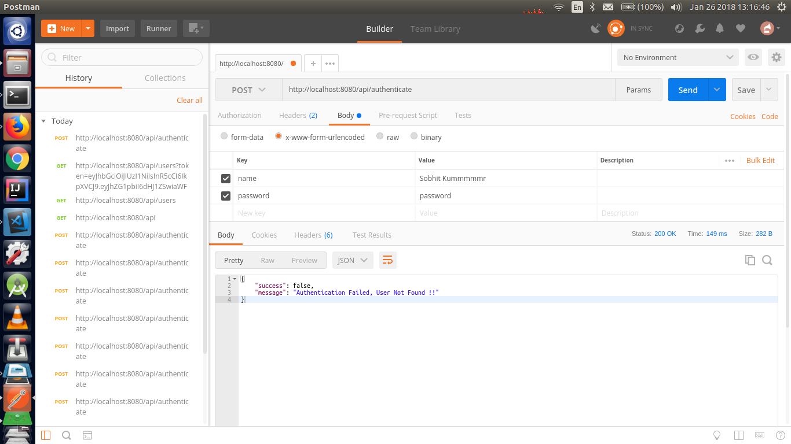
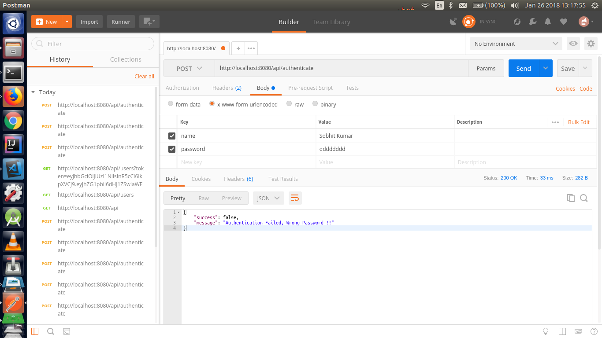
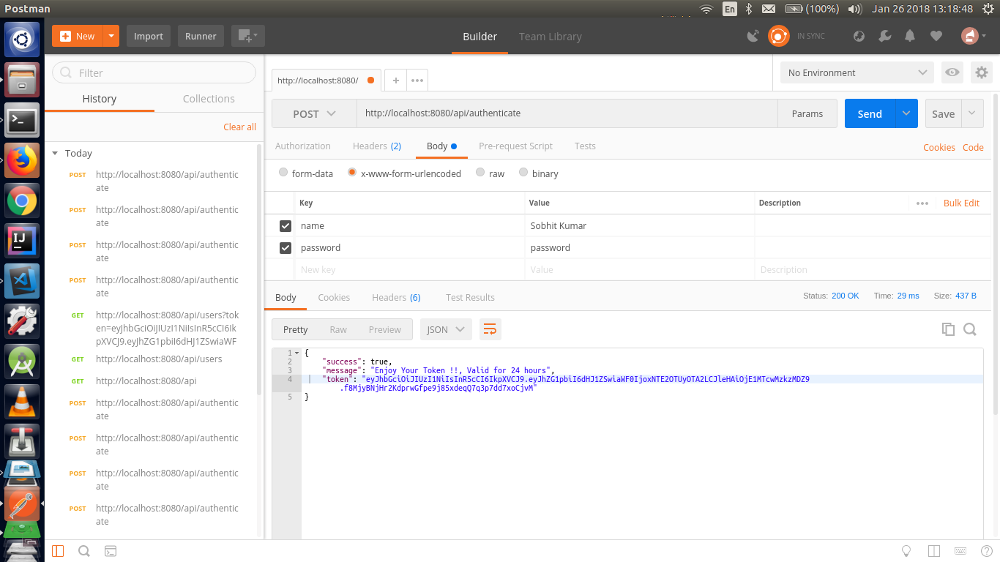
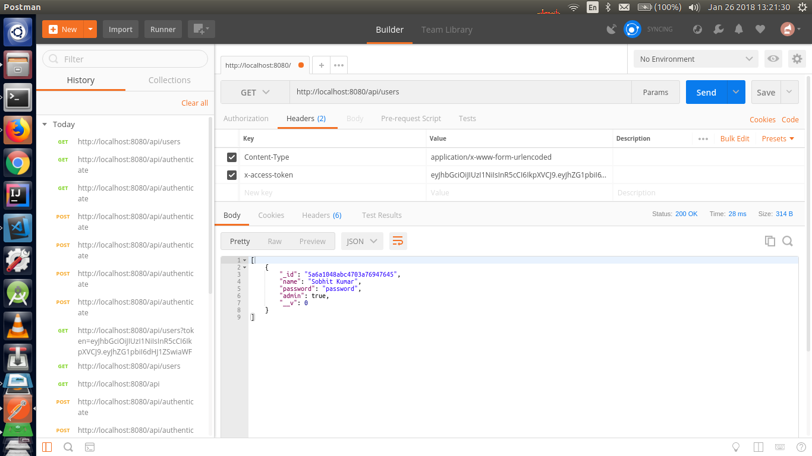

# NodeJSTokenBasedAuthentication

This Repo deals with **Token Based Authentication in NodeJS**. its a demo App which is based on [scotch.io](https://scotch.io/tutorials/authenticate-a-node-js-api-with-json-web-tokens) Web Tutorial.

## Tools used:
  - node and npn
    - **Node** or Node.js is an open-source, cross-platform JavaScript run-time environment for executing JavaScript 
      code server-side.
    - **npm** is a package manager for the JavaScript programming language. It is the default package manager 
      for the JavaScript runtime environment Node.js.
      
  - Postman
    - **Postman** is the complete toolchain for API developers, used by more than 3 million developers and 30000 
      companies worldwide. Postman makes working with APIs faster and easier by supporting developers at 
      every stage of their workflow.
    
  - MongoDB
    - **MongoDB** is a free and open-source cross-platform document-oriented database program. Classified as a 
      NoSQL database program, MongoDB uses JSON-like documents with schemas.
      
  - Other Tools used      
    - Express 
      - **Express** is the popular Node framework

    - Mongoose
      - **Mongoose** is how we interact with our MongoDB database

    - Morgan
      - **Morgan** will log requests to the console so we can see what is happening

    - Body-Parser
      - **Body-Parser** will let us get parameters from our POST requests

    - JsonWebToken
      - **JsonWebToken** is how we create and verify our JSON Web Token
      
 ---
 ## Snapshots:
 > Using Postman
  -  **If User is not Found**
 
 
  - **If Password is Wrong**
 
 
   - **If Both User and Password is Right Token is generated**
 
 
   - **If User Authentication By Token**
 
 
      
  
